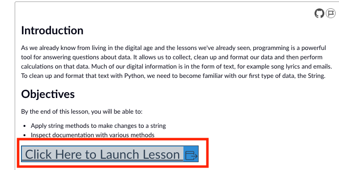
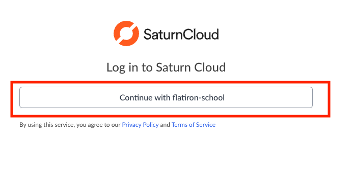
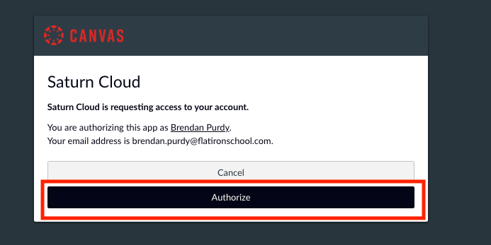
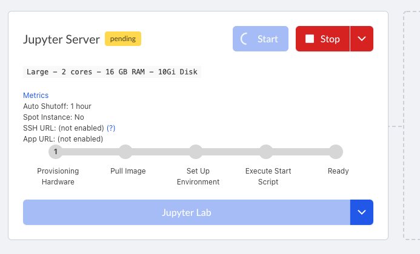
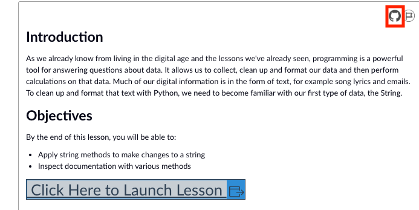

# Running Jupyter Notebooks Locally

## Introduction

In this lesson you will practice the workflow you will be using when you want to work _locally_ instead of in SaturnCloud on Canvas, and also get some hands-on practice with important tools that you will need to be familiar with as a professional Data Scientist: the command line, git, GitHub, and running Jupyter Notebooks locally.

## Objectives

You will be able to:

* Use basic commands to navigate the command line
* Use bash commands to create new files and folders
* Use git clone to clone a repository
* Work on your labs locally

## Setting the Stage

Remember how **Code Lessons** and **Labs** on Canvas use SaturnCloud (by clicking the gray button below) to open notebooks and start coding? 

After you click "Click Here to Launch Lesson," you may see be asked to log into SaturnCloud by clicking "Continue with flatiron-school."

You should only have to do this once, or at most only occasionally.

If you do have to click "Continue with flatiron-school," then you will likely see the next screen where you click "Authorize." Again, you should only have to do this once, or at most only occasionally.

While you should not see the previous two screens that often, the next screen you will see each time you click "Click Here to Launch Lesson" when you have not used the SaturnCloud server for at least an hour or so. Just wait the 30 - 45 seconds for the server to spin up, then it will automatically open the ipython notebook.

When you're a professional Data Scientist, you likely won't have access to SaturnCloud, but you'll need to get everything up and running to work on your local machine. Luckily, you've already set up a professional data science environment, and in this lesson you'll learn how to actually run your code on your local machine instead of through SaturnCloud!

## The Command Line

In order to be able to work locally, we first need to tell you a tiny bit about command line. On Mac computers, this is the terminal application. On Windows computers, we'll use "Git Bash". The command line serves as a low-level interpreter through which you, the user, can send commands directly to the computer. As a computer user, you previously have probably sent commands to the computer through a graphical user interface (GUI) such as a web browser, text editor, photo editor, or any other of the myriad computer programs now in existence. While the command line is initially daunting with its cryptic looking text, we will quickly see some of the many advantages it can have.

One of the many useful features of the command line will be using *git* to clone (download) a local copy of the curriculum hosted on Canvas. This will allow you to work offline and to save changes as you work through exercises and start programming! 

To start, **for Mac users, open the terminal application**, **for Windows, open “Git Bash”**.

### pwd

The first command to try out is **pwd** which stands for **print working directory**. This will tell you where you currently are in the computer's directory structure. Try it out.

### cd

The next essential command is **cd** which stands for **change directory**. This allows you to navigate to different folders on your computer's hard drive. Typing `cd` by itself (or `cd ~`) will automatically take you to your home directory. Typing `cd` and a folder name will take you to that folder. Typing `cd ..` will move you one folder up in the hierarchy. Play around and trying moving between folders for a minute or two.

### Tab Completion

An extraordinarily useful feature when working with the command line is tab completion. This allows you to hit the tab button to autocomplete names once you have made a unique specification.  

For example, if you navigate to your root directory by running the command `cd`, if you're on a Mac, you will probably have 2 folders within your root directory named "Downloads" and "Documents" (these are standard folder names created by default in most systems, although you may have renamed them, or your system may be different). With these, or longer folder names, it can sometimes become cumbersome to type the full folder name. Instead, you can start typing the command and folder name such as `cd Dow` and then press **tab** to autocomplete. Like magic, the command line should complete the statement correctly to be `cd Downloads`. (Note: this will not work if you have another folder that begins with "Dow". Similarly, if you just typed `cd D` or `cd Do` followed by **tab**, the command line will not autocomplete, as the selection is not unique, because **D** or **Do** could both refer to either **Documents** or **Downloads**. Also note that these commands are case sensitive, and folder capitalization much be matched exactly.

### ls

Continuing with navigating the computer's hard drive, it's useful to know how to **list files**. This is done with the `ls` command, short for list.

You can also pass optional parameters to `ls` such as `ls -a` which lists **all files** (including hidden files), `ls -l` gives a **long listing** of files (including file size and last edit times). You can also pass multiple parameters simultaneously, such as `ls -al` to produce a detailed listing of all files.

### * the wildcard parameter

Also very useful is the wildcard parameter. For example, if you wanted to list all files in the current working directory that begin with a, you could type `ls a*`. Here, the asterisk (`*`) denotes anything is allowed following the a. Similarly, to list all pdf files in the current working directory you can use `ls *.pdf`, or to list all text files, you can use `ls *.txt`.

### mkdir

Finally, as you continue to navigate the file directory from the command line it can be useful to be able to create new folders. To do this, use the `mkdir` command, which stands for **make directory**. Try it out with `mkdir NewFolderName`. Afterward, use the `ls` command to see that there is indeed a new folder, and if you wish, move into the new folder using the `cd` command.

## Cloning GitHub repositories and Canvas lessons

You have already read a little bit about GitHub and how it's used to share code. Since you can now navigate the file directory using the command line, you're ready to download some course materials from GitHub to your local environment. In practice, you will do the following:

* **Fork** the course material repository: Forking is the process of making a personal copy of the Canvas course materials on your own GitHub account.

* **Clone** the forked course material repository: Cloning is the process of downloading a repository from GitHub onto your personal computer. 

Don't worry if this process seems a little confusing. It will be explained in more detail soon. For now, you can just follow the steps below: 

* Create a folder on your computer for your course materials and navigate into it  
    * You may also want to create a subfolder titled "phase_1" and navigate into that 
* Return to your web browser and navigate to the lesson you want to download 
* Click the GitHub icon 

You'll be redirected to the associated GitHub repository.

* **Click the fork button**, as shown, in order to create a copy to your personal account which you can edit and update

One of two things will happen. Either it'll pop up a modal (window) and if you scroll to the bottom of it you'll see it says that you already have a fork. If that's the case, just click on the link to view your existing fork.

If you don't already have a fork, you'll be redirected to your new personal copy of the repository:

## Finally 

* Press **cmd + L** to highlight the url bar and **cmd + c** to copy the url (whenever we use **cmd** to refer to holding down the command key on a Mac computer, on a Windows computer, hold down the control key instead)
* Return to the terminal (you should be in your course materials folder or your "phase_1" subfolder)
* Type: `git clone` and paste your repo url (**cmd + v** for Mac; for Windows, in git bash, **shift + insert**)
* Et Voila! The repository and all of its contents will be downloaded locally to your computer!
* Remember that you need to `cd` into the new repository once you've downloaded it 
* The next step is to open your Jupyter Notebook locally (**not on Canvas/SaturnCloud**) using the command line

## Starting the Jupyter Notebook

Make sure to activate your conda virtual environment in your terminal first by typing `conda activate learn-env`. Then type `jupyter notebook` in your command line and press enter. Next, your default browser will open a new window or tab and you will see the list of files that are in your current directory (*remember you want to be in the GitHub repo directory that we just downloaded*). 

> **Note:** To stop a Jupyter Notebook, go to your command line where the notebook is running and press the **control** key + the letter **c** (`ctrl`+`c`).

Then click on the `index.ipynb` file which is the Jupyter Notebook we will be using in this and future labs and lessons. This will open a new tab where you will see the same content you saw in SaturnCloud on Canvas!

## Summary

In this lesson, you learned about the command line, cloning GitHub repositories, and how to work with Jupyter notebooks locally. In the next lab, you'll put what you learned into practice!
